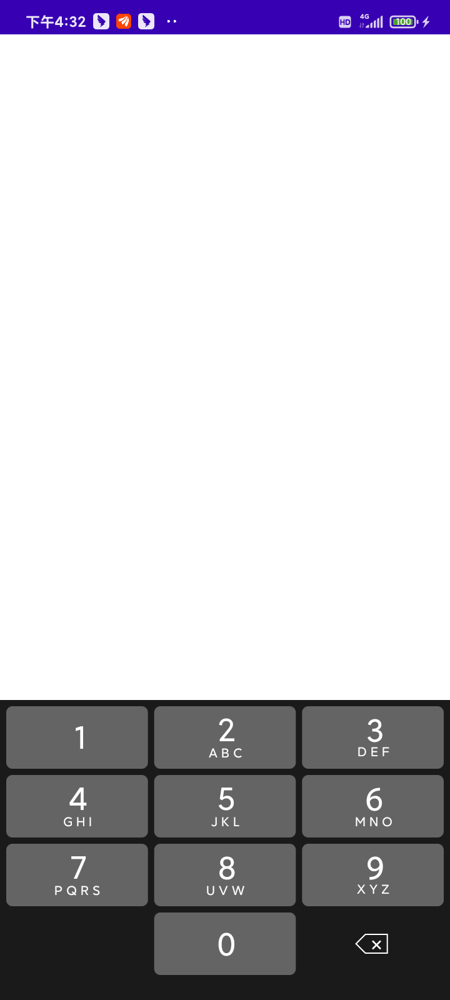
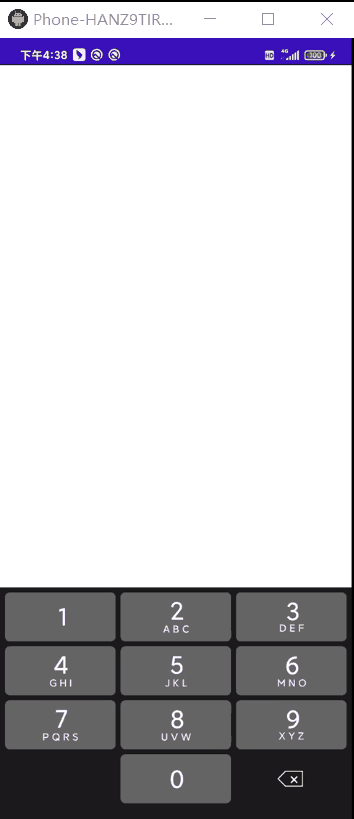

# KeyboardView
自定义数字键盘，源文件存放地址

## 文件解读
就两个文件，不值当的打远程Maven了，大家用的话，直接可以复制到项目里即可。

```
KeyboardView：自定义的数字键盘View
attrs：属性文件
```
#### 效果图

静态图



动态图



## 欢迎关注作者

微信搜索【Android干货铺】，或扫描下面二维码关注，查阅更多技术文章！


### 具体使用方式

[点击查看文章介绍](https://mp.weixin.qq.com/s/XzquvOncqpufuCxb-Qkl2g)

## License

```
Copyright (C) AbnerMing, SearchLayout Open Source Project

Licensed under the Apache License, Version 2.0 (the "License");
you may not use this file except in compliance with the License.
You may obtain a copy of the License at

     http://www.apache.org/licenses/LICENSE-2.0

Unless required by applicable law or agreed to in writing, software
distributed under the License is distributed on an "AS IS" BASIS,
WITHOUT WARRANTIES OR CONDITIONS OF ANY KIND, either express or implied.
See the License for the specific language governing permissions and
limitations under the License.
```
